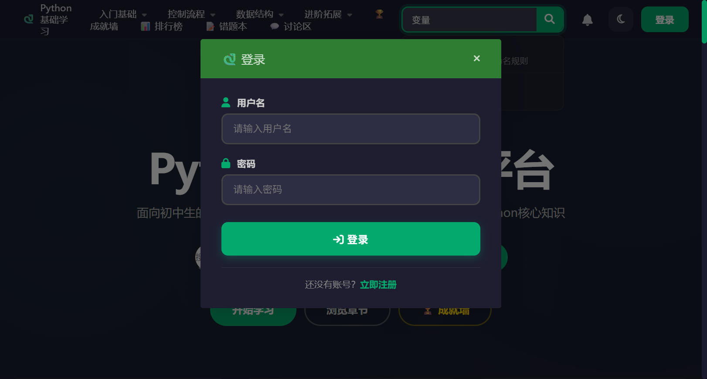
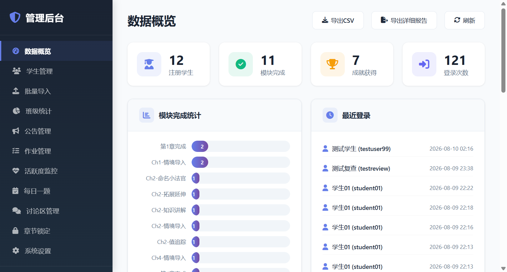
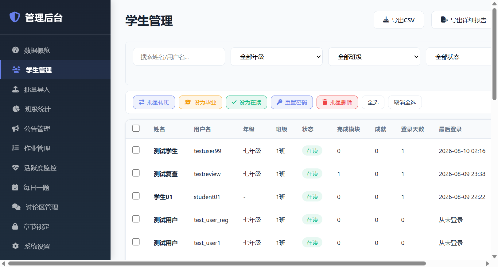

# Python 基础学习平台 — 零基础教师使用手册

> **版本：v3.2** | **最后更新：2026年9月29日** | **适用对象：所有信息科技教师（完全不需要任何电脑基础！）**

---

## 📖 你是哪种用户？请对号入座

开始阅读之前，先看看下面的表格，找到最适合你的阅读路径。不用从头读到尾，挑你需要的部分看就行！

| 你的情况 | 建议这样读 |
|----------|-----------|
| 🆕 我几乎没怎么用过电脑，鼠标键盘都不太熟 | 从「开篇」开始，一字一句读，然后做「5分钟快速体验」 |
| 💻 我会用电脑（上网、打字），但不会装软件 | 先读「开篇」快速扫一遍，然后从「第一部分」开始操作 |
| 🏫 我要在电脑室给学生上课用 | 先做「5分钟快速体验」，再读「第二部分」的第六章 |
| 📊 我已经能启动网站了，想管理学生 | 直接跳到「第二部分」的第五章（管理后台） |
| 🔧 网站启动了但学生连不上 / 遇到报错 | 直接翻到「第四部分：FAQ」，找对应的问题 |
| 🔄 我之前用过，换了新电脑要重新装 | 读「第二部分」的第二章（首次部署） |

---

## 🗺️ 全手册导航

| 部分 | 标题 | 适合谁 | 预计时间 |
|------|------|--------|----------|
| 开篇 | 写给从没接触过电脑的你 | 零基础必读 | 15 分钟 |
| 第一部分 | 5 分钟快速体验 | 想立刻看到效果 | 5 分钟 |
| 第二部分 | 30 分钟完整上手 | 想全面掌握 | 30 分钟 |
| 第三部分 | 日常使用指南 | 每天上课用 | 5 分钟 |
| 第四部分 | 遇到问题怎么办（FAQ） | 遇到任何问题 | 按需查阅 |
| 附录 | 截图索引、技术支持等 | 需要帮助时 | 按需查阅 |

---

# 开篇：写给从没接触过电脑的你（必读！）

> 💡 **重要提示**：如果你平时经常用电脑上网、打字、看视频，可以快速浏览本章，直接跳到「第一部分」开始操作。但如果你对电脑还不熟悉，请一定认真读完这几页——后面的所有操作都建立在这些基础之上！

---

## 0.1 认识你的电脑

### 什么是"桌面"？

打开电脑后，你看到的那个**显示各种小图标的屏幕**，就是"桌面"（就像你办公桌上放东西一样，电脑桌面上放着各种"工具"）。


> 🔴 红色框标注的是桌面上的图标，双击它们可以打开对应的程序

桌面上常见的东西：

| 你看到的东西 | 它是什么 | 能做什么 |
|-------------|----------|----------|
| 小图片（图标） | 程序的"快捷方式" | 双击可以打开一个软件 |
| 底部横条（任务栏） | 显示正在运行的程序 | 点击可以切换窗口 |
| 左下角田字格按钮（开始菜单） | 所有程序的入口 | 点击可以找到电脑里的所有软件 |
| 右下角数字（时间） | 当前时间 | 看看几点了 |

---

### 什么是"鼠标"？

鼠标是你**用手控制屏幕上一个箭头（叫"鼠标指针"）**的工具。就像你用手指在手机上点来点去，在电脑上你通过移动鼠标来控制指针。


> 🔴 红色框标注的是鼠标的左键和右键

**鼠标的基本操作**：

| 操作名称 | 怎么做 | 什么时候用 |
|----------|--------|-----------|
| 移动 | 在桌面上滑动鼠标 | 让屏幕上的箭头移动到你想去的位置 |
| 单击（点一下） | 按一下鼠标**左键**（左边那个键） | 选中一个东西 |
| 双击（点两下） | 快速连续按两下鼠标**左键** | 打开一个文件或程序 |
| 右键（右击） | 按一下鼠标**右键**（右边那个键） | 弹出一个菜单，里面有更多选项 |

> ⚠️ **注意**：左键和右键功能不同！左键是"确定/打开"，右键是"更多选项"。本手册中所有"点击"、"双击"都指的是用**左键**操作。

**怎么判断左右键**：
- 右手握鼠标时，食指自然放在**左键**上，中指放在**右键**上
- 左键通常比右键大，按下去更轻松
- 中间的滚轮用来上下翻页

---

### 什么是"键盘"？

键盘就是你用来**打字**的工具，和手机上的输入法键盘是一个道理，只不过它是实体按键。


> 🔴 红色框标注的是最常用的几个按键

本手册中你会用到的几个按键：

| 按键名称 | 在哪里 | 有什么用 |
|----------|--------|----------|
| 回车键（Enter） | 键盘右侧，最大的那个键 | 确认操作、换行 |
| 空格键 | 键盘最下面，最长的那条 | 输入空格 |
| Ctrl 键 | 键盘左下角和右下角各一个 | 配合其他键使用（如 Ctrl+C 复制） |
| 退格键（Backspace） | 回车键上方，标着 ← 的那个 | 删除前面一个字 |
| 字母和数字键 | 键盘中间大部分区域 | 输入文字和数字 |

---

### 什么是"浏览器"？

浏览器就是**你用来"看网页"的软件**。就像：
- 看电视需要**电视机** → 看网页需要**浏览器**
- 打电话需要**手机上的电话 App** → 上网需要**浏览器**

你电脑上可能已经安装了以下浏览器中的一种或几种：

| 浏览器图标 | 名称 | 怎么认出来 |
|-----------|------|-----------|
| 蓝色/绿色圆形 🔵🟢 | Google Chrome（谷歌浏览器） | 像一个彩色圆球 |
| 蓝色"e"字 🔵 | Microsoft Edge | Windows 自带，一个蓝色的 e |
| 橙色狐狸 🦊 | Firefox（火狐浏览器） | 像一只狐狸抱着地球 |

> **提示**：如果你的电脑上装了 Chrome 或 Edge，用哪个都行。如果没有，Edge 是 Windows 自带的，一定能找到。

**如何打开浏览器**：
1. 看屏幕底部的任务栏（底部横条），找到浏览器图标
2. 或者双击桌面上的浏览器图标
3. 浏览器打开后，你会看到一个白色的长条——这就是**地址栏**（输入网址的地方）


> 🔴 红色框标注的是地址栏，你在这里输入网址后按回车键就能打开网页

---

### 什么是"文件和文件夹"？

**文件**就像一张纸，上面写着内容。比如：
- 一篇 Word 作文 → 一个文件
- 一张照片 → 一个文件
- 一首歌 → 一个文件

**文件夹**就像一个文件袋，里面可以装很多文件。文件夹的图标通常是一个黄色的夹子模样 📁。

**怎么找到项目文件夹**：
当你拿到本项目的文件时，通常是一个文件夹（名字叫 `PythonVariableLesson`），里面装着所有需要的文件。你可以把它放在：
- 桌面上（最容易找到）
- D 盘根目录下
- 任何你方便找到的地方

> ⚠️ **重要**：文件夹的路径（位置）中**不要包含中文**！比如放在 `D:\PythonVariableLesson\` 是可以的，但不要放在 `D:\我的文件\Python学习\` 这样的路径下。

**如何打开文件夹**：
1. 把鼠标指针移到文件夹图标上
2. 快速连续点击两下鼠标左键（这就是"双击"）
3. 文件夹就打开了，你会看到里面的文件


> 🔴 红色框标注的是需要双击的文件夹

---

### 什么是"命令行窗口"（黑色窗口）？

在本手册中，你经常会看到"弹出黑色窗口"这样的描述。这就是**命令行窗口**——它是电脑和你"对话"的地方。


> 🔴 红色框标注的是命令行窗口，里面有白色文字在滚动

**你需要知道的事**：
- 这个窗口里会出现很多英文和代码，**你不需要看懂它们**
- 只要窗口**没有自己关掉**，就说明程序在正常运行
- 如果窗口里出现了 `http://localhost:3000` 这样的地址，说明网站已经启动成功了
- **千万不要关掉这个窗口**！关掉它，网站就停了，学生就看不到了

---

### 什么是"复制"和"粘贴"？

这是电脑上最常用的操作之一，就像把一段文字抄到另一张纸上：

| 操作 | 怎么做 | 效果 |
|------|--------|------|
| 复制（Ctrl+C） | 先选中文字，按住 Ctrl 键不放，再按一下 C 键 | 把内容"记住" |
| 粘贴（Ctrl+V） | 点一下要放的位置，按住 Ctrl 键不放，再按一下 V 键 | 把记住的内容"贴过来" |
| 剪切（Ctrl+X） | 先选中文字，按住 Ctrl 键不放，再按一下 X 键 | 把内容"剪下来"（原位置删除） |

> 📝 **记忆口诀**：C 是 Copy（复制），V 像粘贴的胶水，X 像剪刀（剪切）

---

### 开篇验收检查 ✅

读完本章后，你应该能回答以下问题：

- [ ] 我知道"桌面"就是打开电脑后看到的那个屏幕
- [ ] 我知道鼠标左键和右键的区别，会用左键单击和双击
- [ ] 我知道浏览器就是"看网页的软件"，知道地址栏在哪里
- [ ] 我知道文件和文件夹的区别
- [ ] 我知道"命令行窗口"是那个黑色窗口，不能随便关掉
- [ ] 我知道 Ctrl+C 复制、Ctrl+V 粘贴

---

# 第一部分：5 分钟快速体验

> 🎯 **学习目标**：不需要理解任何原理，只需要跟着步骤操作，5 分钟内看到网站在浏览器中打开。

---

## 第一步：找到项目文件夹

1. 看看你的桌面上有没有一个叫 `PythonVariableLesson` 的文件夹
2. 如果桌面上没有，回忆一下你把项目文件放在哪里了（U 盘？D 盘？）
3. 把鼠标指针移到文件夹图标上，**双击**打开它
4. 打开后你会看到很多文件，不用管它们是什么


> 🔴 红色框标注的是 `PythonVariableLesson` 文件夹，双击打开它

---

## 第二步：双击启动文件

1. 在打开的文件夹里，找到名字叫 `start_server.bat` 的文件
   - 它的图标可能是一个齿轮 ⚙️，或者一个白色方框
   - 文件名后面有 `.bat` 三个字母
2. 把鼠标指针移到这个文件上，**双击**它
3. 会弹出一个**黑色窗口**，里面开始出现白色文字
4. 不用管里面写了什么，只需要等待


> 🔴 红色框标注的是 `start_server.bat` 文件，双击它

> ⚠️ **注意**：如果弹出蓝色背景的对话框问"是否允许"，请点击「是」。

---

## 第三步：等待启动完成

1. 黑色窗口里会不断出现文字，这是在自动帮你启动网站
2. 等待大约 5-10 秒，直到看到类似这样的文字：

```
==============================================
  Python Variable Adventure
==============================================
  Teacher (this machine):
    http://localhost:3000
    http://localhost:3000/admin.html
==============================================
```

3. 看到 `http://localhost:3000` 就说明成功了！


> 🔴 红色框标注的是启动成功的信息，其中 `http://localhost:3000` 就是网站的地址

> **提示**：如果浏览器自动打开了网站首页，那就更方便了，直接跳到第四步。如果浏览器没有自动打开，请继续下一步。

---

## 第四步：在浏览器中打开网站

1. 打开你的浏览器（Chrome 或 Edge 都可以）
2. 找到浏览器顶部的**地址栏**（一个白色的长条）
3. 在地址栏里点击一下，输入：`localhost:3000`
4. 按键盘上的**回车键**（Enter）
5. 等待页面加载，你会看到网站首页


> 🔴 红色框标注的是浏览器地址栏，在这里输入 `localhost:3000` 后按回车键

---

## 第五步：确认网站正常

网站首页打开后，你应该能看到：

- 顶部有一个深色的导航栏（写着"Python 基础学习"之类的文字）
- 中间有各种章节卡片，排列整齐
- 底部有版权信息

如果能看到这些，说明网站已经成功启动了！🎉



> 🔴 红色框标注的是网站首页的主要区域

---

## 快速体验验收检查 ✅

- [ ] 我能找到项目文件夹并打开它
- [ ] 我能找到 `start_server.bat` 文件并双击启动
- [ ] 我能看到黑色窗口中的启动成功信息
- [ ] 我能在浏览器地址栏输入 `localhost:3000` 并打开网站
- [ ] 我能看到网站首页（有导航栏和章节卡片）

---

# 第二部分：30 分钟完整上手

> 🎯 **学习目标**：全面掌握本平台的部署、使用和管理方法，能独立在电脑室中开展教学。

---

## 第一章：认识你的工具

### 🎯 本章学习目标

- 了解 Python 基础学习平台是什么
- 了解网站包含哪些内容
- 了解教师端和学生端分别能做什么

---

### 1.1 这个平台是什么？

Python 基础学习平台是一个**在浏览器中学习 Python 编程的网站**。它就像一个互动式的课本，学生可以在上面：

- 阅读知识讲解（像看书一样）
- 动手写代码（网站内置了代码编辑器）
- 做练习题（做完立刻知道对错）
- 获得成就徽章（像游戏闯关一样）
- 查看自己的学习进度

**用大白话说**：这就是一个"会教 Python 的网站"，学生打开浏览器就能学，不需要安装任何软件。

> 🏫 **当前版本定位**：本平台为**计算机机房局域网版本**。网站运行在教师机上，学生通过机房局域网访问，**无需连接互联网**。学生只能在机房内使用，无法从校外访问。未来将推出互联网公开版本，届时会另行通知。

---

### 1.2 网站里有什么内容？

网站共包含 **19 个章节**，按难度分为四大板块：

| 板块 | 章节范围 | 像什么 |
|------|----------|--------|
| 🚀 入门基础 | 第 1-3 章 | 学走路——认识 Python、变量、变量类型 |
| 🔀 控制流程 | 第 4-10 章 | 学骑车——条件判断、循环、循环嵌套、综合应用、字符图形 |
| 📋 数据结构 | 第 11-15 章 | 学开车——列表、元组、字典、字符串 |
| 💡 进阶拓展 | 第 16-19 章 | 上高速——编程思维、二进制、数制转换 |

每个章节又分为多个教学环节（模块）：

| 模块名称 | 图标 | 是干什么的 |
|----------|------|-----------|
| 情境导入 | 🎬 | 用一个生活场景引出本章要学的内容 |
| 知识讲解 | 📖 | 系统地讲解知识点（像老师讲课） |
| 互动实验室 | 🔬 | 拖拽、点击等方式动手理解概念 |
| 实践操作 | 💻 | 在代码编辑器里写 Python 代码 |
| 调试诊所 | 🔧 | 找出代码中的错误并修复 |
| 扩展思维 | 💡 | 拓展知识，开阔思路 |
| 创意项目 | 🎨 | 完成一个小项目，综合运用所学 |
| 课堂小测 | 📝 | 选择题测试，检验学习效果 |

---

### 1.3 教师端和学生端分别是什么？

| | 教师端 | 学生端 |
|------|------|------|
| 用什么打开 | `localhost:3000/admin.html` | `localhost:3000` |
| 谁用 | 老师 | 学生 |
| 能做什么 | 管理学生、看数据、发布公告 | 注册、登录、学习章节 |
| 需要账号吗 | 需要（默认 admin/admin123） | 需要注册 |

---

### 1.4 成就系统简介

学生在学习过程中会自动解锁**成就徽章**，就像游戏里的"奖杯"🏆：

- **19 个章节成就**：每完成一章获得一个徽章
- **4 个里程碑成就**：完成整个板块获得一个徽章
- **1 个终极成就**「全能学霸」👑：完成全部 19 章

当学生解锁新成就时，页面右下角会弹出一个漂亮的提示框，让学生有成就感，激发学习动力。

---

### ✅ 本章验收检查

- [ ] 我知道这个平台是一个"在浏览器中学 Python 的网站"
- [ ] 我知道网站有 19 个章节，分 4 个板块
- [ ] 我知道每个章节有 8 种教学模块
- [ ] 我知道教师端和学生端的区别
- [ ] 我知道成就系统是用来激励学生的

---

## 第二章：启动网站服务器

### 🎯 本章学习目标

- 理解"服务器"是什么
- 掌握首次部署和日常启动两种操作
- 能判断启动是否成功

---

### 2.1 什么是"服务器"？

**服务器**就是"让网站运行起来的程序"。

你可以这样理解：
- 你想看一部电影 → 需要打开**播放器**
- 你想让学生访问网站 → 需要启动**服务器**
- 播放器关了电影就停了 → 服务器关了网站就停了

当你双击 `start_server.bat` 时，就是在启动这个"服务器程序"。它开始在后台运行，让学生的浏览器能找到你的网站。

---

### 2.2 你需要准备什么？

**硬件**：
- 一台 Windows 10 或 Windows 11 电脑（作为教师机）
- 电脑需要能上网（首次部署时需要下载东西，之后可以离线使用）
- 建议内存 4GB 以上

**软件**：完全不需要提前安装任何软件！脚本会自动帮你搞定一切。

---

### 2.3 两种启动方式

| | 首次部署 | 日常启动 |
|------|------|------|
| 双击哪个文件 | `setup_server.bat` | `start_server.bat` |
| 什么时候用 | 新电脑第一次用 | 之后每次上课用 |
| 需要多长时间 | 5-15 分钟 | 3-5 秒 |
| 需要联网吗 | 需要 | 不需要 |
| 用几次 | 只用一次 | 每次上课都用 |

---

### 2.4 首次部署（新电脑第一次用）

> **【重要】只在第一次使用或换新电脑时做这个操作！**

**操作步骤**：

1. 打开 `PythonVariableLesson` 文件夹
2. 找到 `setup_server.bat` 文件
3. **双击** `setup_server.bat`
4. 会弹出黑色窗口，开始自动安装和配置


> 🔴 红色框标注的是 `setup_server.bat` 文件，首次部署时双击它

**脚本会自动帮你做以下事情**：

| 步骤 | 做什么 | 大约多久 |
|------|--------|----------|
| 1 | 检查/安装 Node.js（网站运行的基础环境） | 2-5 分钟 |
| 2 | 安装需要的依赖包 | 1-2 分钟 |
| 3 | 检查/安装 MySQL（存放学生成绩的数据库） | 3-5 分钟 |
| 4 | 配置数据库 | 1-2 分钟 |
| 5 | 启动网站 | 几秒钟 |

**过程中可能遇到的情况**：

- **弹出蓝色背景的对话框**：点击「是」即可，这是正常的权限确认
- **杀毒软件弹出警告**：选择「允许」或「信任」，本程序是安全的
- **窗口里出现很多英文**：不用管，等它自己跑完就行

> ⚠️ **注意**：
> - 部署过程中**不要关闭黑色窗口**
> - 项目文件夹路径中**不要有中文**（如 `C:\Python学习\` 不行，`C:\PythonLesson\` 可以）
> - 确保电脑能上网

---

### 2.5 日常启动（每次上课用）

> **【重要】这是你每天最常用的操作！**

**操作步骤**：

1. 打开 `PythonVariableLesson` 文件夹
2. 找到 `start_server.bat` 文件
3. **双击** `start_server.bat`
4. 等待黑色窗口中出现启动成功信息（约 3-5 秒）
5. 浏览器会自动打开网站首页


> 🔴 红色框标注的是 `start_server.bat`，每天双击它就能启动网站

**启动成功的标志**：黑色窗口中显示：

```
==============================================
  Python Variable Adventure
==============================================
  Teacher (this machine):
    http://localhost:3000
    http://localhost:3000/admin.html
  Students (LAN - share this address):
    http://192.168.x.x:3000
==============================================
```

---

### 2.6 关闭网站

下课之后，你需要关闭网站：

1. 找到那个**黑色窗口**
2. 按键盘上的 `Ctrl + C`（按住 Ctrl 不放，再按 C）
3. 窗口里的文字停止滚动，出现输入提示符
4. 点击窗口右上角的 × 关闭窗口

> ⚠️ **重要**：上课期间**绝对不能关掉这个黑色窗口**！关了网站就停了，所有学生都会掉线。

---

### ✅ 本章验收检查

- [ ] 我知道"服务器"就是让网站运行的程序
- [ ] 我知道首次部署用 `setup_server.bat`，日常用 `start_server.bat`
- [ ] 我能在新电脑上完成首次部署
- [ ] 我能每天双击 `start_server.bat` 启动网站
- [ ] 我能看到黑色窗口中的启动成功信息
- [ ] 我知道上课期间不能关黑色窗口

---

## 第三章：打开网站首页

### 🎯 本章学习目标

- 学会在浏览器中打开网站
- 理解三种不同的访问地址
- 能判断网站是否正常运行

---

### 3.1 三种访问地址

启动成功后，网站提供了三种访问地址：

| 地址 | 在哪里用 | 谁用 |
|------|----------|------|
| `http://localhost:3000` | 教师机自己的浏览器 | 老师自己测试 |
| `http://localhost:3000/admin.html` | 教师机自己的浏览器 | 老师管理后台 |
| `http://192.168.x.x:3000` | 学生机的浏览器 | 学生上课用 |

> 📝 **说明**：`192.168.x.x` 是教师机的局域网地址，每台电脑不同，启动时会显示在黑色窗口中。比如可能是 `http://192.168.0.104:3000` 或 `http://10.20.30.15:3000`。

---

### 3.2 如何打开网站

**方法一：浏览器自动打开**（推荐）
- 启动脚本会自动帮你打开浏览器，跳转到网站首页

**方法二：手动输入地址**
1. 打开浏览器
2. 在地址栏（顶部白色长条）中输入 `localhost:3000`
3. 按回车键


> 🔴 红色框标注的是地址栏，输入 `localhost:3000` 后按回车

---

### 3.3 如何判断网站是否正常

打开 `http://localhost:3000` 后，你应该看到：

- ✅ 顶部深色导航栏（有 Logo、菜单等）
- ✅ 中间区域有章节卡片排列
- ✅ 底部有版权信息
- ❌ 如果页面空白、乱码、或显示"无法访问"，说明有问题

> **提示**：如果页面显示不正常，试试按 `Ctrl + F5` 强制刷新。如果还不行，查看 FAQ。

---

### 3.4 如何放大缩小页面

如果页面上的字太小看不清：

| 操作 | 效果 |
|------|------|
| 按住 `Ctrl` 键不放，滚动鼠标滚轮**向上** | 放大页面 |
| 按住 `Ctrl` 键不放，滚动鼠标滚轮**向下** | 缩小页面 |
| 按住 `Ctrl` 键不放，按一下 `0` 键 | 恢复默认大小 |

---

### ✅ 本章验收检查

- [ ] 我能在浏览器中打开 `http://localhost:3000`
- [ ] 我知道三种访问地址的区别
- [ ] 我能判断网站是否正常启动
- [ ] 我会放大缩小页面

---

## 第四章：学生如何使用

### 🎯 本章学习目标

- 了解学生从注册到学习的完整流程
- 能指导学生完成注册和登录
- 了解学生端各项功能

---

### 4.1 学生注册账号

学生第一次使用前需要注册账号：

**操作步骤**：

1. 打开浏览器，输入教师给的地址（如 `http://192.168.0.104:3000`）
2. 点击页面右上角的「登录」按钮
3. 在弹出的登录窗口中，点击「没有账号？立即注册」


> 🔴 红色框标注的是「没有账号？立即注册」链接

4. 填写注册信息：

| 字段 | 填什么 | 示例 |
|------|--------|------|
| 姓名 | 你的真实姓名 | 张三 |
| 用户名 | 登录用的账号（建议用姓名拼音） | zhangsan |
| 密码 | 自己记住的密码（至少 6 位，**必须包含字母和数字**） | Abc123456 |
| 年级 | 从下拉列表中选择 | 七年级 |
| 班级 | 从下拉列表中选择（1班~20班） | 1班 |

5. 点击「注册」按钮
6. 注册成功后，系统会自动登录

---

### 4.2 学生登录

注册之后，每次上课只需登录：

1. 打开浏览器，输入教师给的地址
2. 点击右上角「登录」按钮


> 🔴 红色框标注的是登录表单，输入用户名和密码后点击登录

3. 输入**用户名**和**密码**
4. 点击「登录」按钮
5. 登录成功后，导航栏会显示你的姓名

---

### 4.3 学生如何学习

登录后，学生看到的首页上排列着所有章节：


> 🔴 红色框标注的是章节卡片，点击即可进入学习

**学习流程**：

1. 点击一个章节卡片（如「第1章 认识Python」）
2. 进入章节学习页面，顶部有次级导航栏，列出了所有教学模块


> 🔴 红色框标注的是次级导航栏，点击各个模块进行学习

3. 从左到右依次点击每个模块学习
4. 完成全部模块后，该章节标记为"已完成"
5. 系统会自动记录学习进度，下次登录时可以继续

---

### 4.4 学生端其他功能

| 功能 | 在哪里 | 能做什么 |
|------|--------|----------|
| 🏆 成就墙 | 导航栏「成就墙」 | 查看获得的徽章和学习统计 |
| 📊 排行榜 | 导航栏「排行榜」 | 看全班同学的学习排名 |
| 🔍 搜索 | 导航栏搜索框 | 输入关键词找章节 |
| 🌓 主题切换 | 导航栏太阳/月亮图标 | 切换亮色/暗色模式 |
| 📝 错题本 | 导航栏「错题本」 | 复习做错的题目 |
| 📒 学习笔记 | 章节学习页面 | 记录学习心得 |
| 💬 讨论区 | 导航栏「讨论区」 | 和同学交流讨论 |
| 📅 每日一题 | 成就墙页面 | 做老师发布的每日编程题 |

---

### ✅ 本章验收检查

- [ ] 我能指导学生完成注册
- [ ] 我能指导学生完成登录
- [ ] 我知道学生如何选择一个章节开始学习
- [ ] 我知道学生端有哪些功能

---

## 第五章：教师如何使用（管理后台）

### 🎯 本章学习目标

- 学会登录管理后台
- 掌握学生管理、数据查看等核心功能
- 学会发布公告、锁定章节等教学管理操作

---

### 5.1 登录管理后台

**操作步骤**：

1. 在浏览器地址栏输入 `http://localhost:3000/admin.html`
2. 你会看到管理后台的登录页面


> 🔴 红色框标注的是登录表单，输入用户名和密码

3. 输入默认账号密码：

| 字段 | 默认值 |
|------|--------|
| 用户名 | `admin` |
| 密码 | `admin123` |

4. 点击「登录」按钮
5. 登录成功后，你会看到左侧深色导航栏和右侧数据概览

> ⚠️ **安全提示**：首次登录后，强烈建议立即修改默认密码！修改方法见本章 5.7 节。

---

### 5.2 管理后台功能一览

左侧导航栏包含以下功能页面：

| 菜单项 | 能做什么 |
|--------|----------|
| 📊 数据概览 | 看整体数据：学生数、完成数、活跃度 |
| 👥 学生管理 | 查看、搜索、编辑、删除学生账号 |
| 📤 批量导入 | 通过 Excel 文件批量导入学生 |
| 📈 班级统计 | 按班级查看学习数据 |
| 📢 公告管理 | 发布和管理公告 |
| 📋 作业管理 | 发布作业、查看提交、评分 |
| 🖼️ 作品截图 | 查看学生提交的编程作品截图 |
| 💓 活跃度监控 | 查看学生登录情况 |
| 📅 每日一题 | 发布每日编程题 |
| 💬 讨论区管理 | 管理学生讨论内容 |
| 🔒 章节锁定 | 控制学生可以访问哪些章节 |
| 👤 注册管理 | 控制注册开关、防止学生重复注册、合并账号 |
| ⚙️ 系统设置 | 修改管理员密码、一键备份数据、查看操作日志 |

---

### 5.3 数据概览（仪表盘）



> 🔴 红色框标注的是四个统计卡片，显示关键数据

登录后默认显示数据概览页面，包含：

- **四个统计卡片**：注册学生数、模块完成数、成就获得数、登录次数
- **模块完成统计**：各模块的完成人数分布
- **最近登录记录**：最近登录的学生和时间
- **学习趋势图**：近 30 天的学习活跃度变化
- **章节完成率**：每个章节的完成比例

顶部工具栏：
- **导出 CSV**：导出数据用 Excel 打开
- **刷新**：刷新页面获取最新数据

---

### 5.4 学生管理



> 🔴 红色框标注的是学生列表和搜索框

点击左侧「学生管理」进入，可以：

- **搜索学生**：在搜索框中输入姓名或用户名
- **筛选学生**：按年级、班级、状态筛选
- **查看详情**：点击学生姓名查看详细学习数据
- **批量操作**（勾选学生后）：
  - 转班：将学生转到其他班级
  - 设毕业/在读：修改学生状态
  - 重置密码：重置为默认密码 `abc123`
  - 批量删除：删除学生账号及数据
- **单个操作**：每行右侧有「重置密码」和删除按钮

---

### 5.5 批量导入学生

1. 点击左侧「批量导入」
2. 下载 CSV 模板（点击「下载模板」按钮）
3. 用 Excel 打开模板文件
4. 按格式填写：`姓名,用户名,密码,年级,班级`
   - 例如：`张三,zhangsan,mypass123,七年级,3`（班级用数字，3 表示 3 班）
5. 保存文件
6. 回到管理后台，点击「选择文件」上传
7. 点击「导入」按钮

---

### 5.6 章节锁定

点击左侧「章节锁定」进入，可以控制学生端哪些章节能访问：
- 默认所有章节开放
- 可以按章节单独锁定/解锁
- 支持按「年级 + 班级」维度锁定：选择"全部年级/全部班级"即对全体学生生效，也可以只锁定某个年级或某个班级
- 适合逐步开放教学内容的场景（如考试时只开放考试章节）

**操作步骤**：
1. 在顶部筛选栏选择要锁定的「年级」和「班级」（默认"全部年级/全部班级"）
2. 点击章节卡片切换锁定/解锁状态（红色=锁定，绿色=解锁）
3. 可用「全部锁定」「全部解锁」按钮快速批量操作
4. 点击「保存设置」按钮保存

**学生端效果**：被锁定的章节，学生点击后会弹出「🔒 章节已锁定」提示，无法进入学习；老师解锁后学生即可正常访问。

---

### 5.7 修改管理员密码

> **【重要】首次登录后请立即修改密码！**

1. 点击左侧「系统设置」
2. 找到「修改密码」选项
3. 输入旧密码（默认 `admin123`）
4. 输入新密码（两次确认）
5. 点击保存

> 📝 **建议**：新密码至少 8 位，包含字母和数字，不要用生日或简单密码。

---

### 5.8 注册管理（控制学生注册）

> 🎯 **学习目标**：学会控制学生注册开关、防止学生重复注册、合并重复账号。

#### 什么是注册管理？

注册管理是老师用来控制学生注册行为的工具。你可以：
- **一键开关注册**：需要学生注册时开启，不需要时关闭，防止学生随意注册
- **防止重复注册**：启用学号验证，确保每个学生只注册一个账号
- **合并重复账号**：如果学生已经注册了多个账号，可以把它们合并成一个

**什么时候需要用到注册管理**：
- 新学期第一周，开启注册让全班学生注册账号
- 全班学生都已注册完成后，可以关闭注册，避免学生在课堂上注册多余账号
- 发现学生注册了多个账号时，用合并功能合到一起

---

#### 注册开关

这是最常用的功能——就像一个"水龙头"，拧开学生就能注册，拧上就不能注册。

**操作步骤**：

1. 点击左侧菜单「注册管理」
2. 你会看到第一个卡片——「注册开关」


> 🔴 红色框标注的是注册开关，点击蓝色圆形按钮即可切换

3. 点击开关按钮：
   - **绿色**：注册功能已开启，学生可以正常注册
   - **红色**：注册功能已关闭，学生无法注册新账号

4. 开关下方会显示当前状态文字提示

> 📝 **建议**：全班学生注册完成后，可以关闭注册开关。这样学生在课堂上就不会误操作注册多余账号。

---

#### 注册限制配置

除了开关，你还可以设置更细致的限制：

| 设置项 | 是什么 | 建议值 |
|--------|--------|--------|
| 要求填写学号 | 开启后，学生注册时必须填写学号 | 建议开启 |
| 同一IP最大注册数 | 同一台电脑在冷却期内最多能注册几个账号 | 3-5 个 |
| 注册冷却时间 | 达到上限后，需要等多久才能再次注册 | 5 分钟 |
| 同一学号最大账号数 | 一个学号最多能注册几个账号 | 1 个 |

**操作步骤**：
1. 在「注册限制配置」卡片中修改各项数值
2. 点击「保存配置」按钮
3. 看到"已保存"提示即成功

---

#### 查找重复账号

如果怀疑有学生注册了多个账号，可以使用检测功能：

**操作步骤**：
1. 在「疑似重复账号检测」卡片中，点击「检测」按钮
2. 系统会自动找出：
   - **同名账号**：同名的学生可能注册了两次
   - **同IP多账号**：同一台电脑上注册了多个账号


> 🔴 红色框标注的是检测结果，红色框标注的是「合并」按钮

3. 如果发现重复账号，点击旁边的「合并」按钮，系统会自动填充合并表单

---

#### 合并账号

如果学生确实注册了多个账号，可以把它们合并成一个。合并后：
- 源账号的**学习进度、成就、笔记、作业**都会迁移到目标账号
- 源账号会被**删除**
- 操作**不可恢复**，请谨慎操作

**操作步骤**：
1. 在「账号合并」卡片中，输入学生姓名搜索
2. 在「源账号」框中，选择**要被合并的账号**（即将被删除的）
3. 在「目标账号」框中，选择**保留的账号**（数据都归到这个账号）
4. 点击「合并账号」按钮


> 🔴 红色框标注的是源账号搜索框和目标账号搜索框

5. 在确认弹窗中确认操作
6. 合并完成后，会显示合并了多少条学习进度和多少个成就

> ⚠️ **注意**：合并账号是**不可逆**的操作！合并前请确认选对了账号。

---

#### 查看注册记录

在「注册审计日志」卡片中，你可以看到所有学生注册的详细记录：

- **时间**：什么时候注册的
- **用户名、姓名**：谁注册的
- **IP地址**：从哪台电脑注册的
- **结果**：成功 / 失败 / 被阻止
- **原因**：如果失败了，是什么原因

> 📝 **用途**：如果发现异常注册行为（如同一台电脑短时间内注册大量账号），可以在这里找到证据。

---

#### 注册管理常见场景

**场景一：每天上课前**
1. 打开管理后台 → 注册管理
2. 确认注册开关是**绿色**（开启状态）
3. 这样学生就能正常注册和登录了

**场景二：全班注册完成后**
1. 打开管理后台 → 注册管理
2. 点击开关，变为**红色**（关闭状态）
3. 这样学生在课堂上就不会再注册多余账号了

**场景三：发现学生有多个账号**
1. 打开注册管理 → 点击「检测」按钮
2. 找到该学生的重复账号
3. 使用合并功能合到一起

---

### ✅ 本章验收检查

- [ ] 我能登录管理后台（`localhost:3000/admin.html`）
- [ ] 我能查看数据概览页面
- [ ] 我能搜索和查看学生信息
- [ ] 我能批量导入学生
- [ ] 我能锁定/解锁章节
- [ ] 我能控制注册开关（上课开启、下课关闭）
- [ ] 我能检测重复账号并进行合并
- [ ] 我已修改管理员默认密码

---

## 第六章：在电脑室中使用（局域网部署）

### 🎯 本章学习目标

- 理解局域网部署的原理
- 能让全班学生在自己电脑上访问网站
- 能排查学生无法访问的问题

---

### 6.1 原理说明（用大白话）

**局域网**就是"同一个网络里的电脑群"。

比如：
- 你家所有连在同一个 WiFi 上的手机、电脑 → 它们在同一个局域网
- 电脑室里所有电脑连在同一个交换机上 → 它们在同一个局域网

网站跑在**教师机**上，学生机通过局域网地址来访问教师机上的网站。

> 🏫 **这就是当前版本的使用方式**：网站运行在教师机上，学生通过机房局域网访问。学生端**不需要连接互联网**，只需要能和教师机互通即可。

> 📝 **简单理解**：教师机是"主持人"，学生机是"观众"。主持人把自己的屏幕分享出来，观众通过局域网地址就能看到。

---

### 6.2 教师机操作（每次上课前）

1. 在教师机上双击 `start_server.bat`
2. 等待黑色窗口显示启动信息
3. 在窗口中找「Students (LAN)」后面的地址


> 🔴 红色框标注的是局域网地址，记下来告诉学生

4. 将这个地址告诉学生（写在黑板上，或通过电子教室软件广播）
   - 例如：`http://10.20.30.15:3000` 或 `http://192.168.0.104:3000`

---

### 6.3 学生机操作（第一次使用）

1. 打开浏览器
2. 在地址栏输入教师给的局域网地址
3. 按回车键
4. 看到网站首页后，点击「登录」→「没有账号？立即注册」
5. 填写注册信息完成注册
6. 注册成功后即可开始学习

---

### 6.4 学生机操作（之后每次上课）

1. 打开浏览器
2. 输入局域网地址（和上次一样）
3. 输入用户名和密码，点击登录
4. 从上次学习进度继续

---

### 6.5 学生无法访问时的排查步骤

按顺序逐一检查：

| 序号 | 检查项 | 怎么做 |
|------|--------|--------|
| 1 | 教师机黑色窗口还开着吗？ | 看教师机屏幕上有没有那个黑色窗口，如果关了请重新双击 `start_server.bat` |
| 2 | 学生输入的地址正确吗？ | 确认地址以 `http://` 开头，包含冒号和 3000，数字没有输错 |
| 3 | 在同一个局域网吗？ | 教师机和学生机是否连在同一个交换机上 |
| 4 | 教师机能自己访问吗？ | 在教师机浏览器中输入 `http://localhost:3000`，看能否打开 |
| 5 | 教师机能用局域网地址访问吗？ | 在教师机浏览器中输入局域网地址，看能否打开 |
| 6 | 防火墙是否阻止了？ | 查看 FAQ 中的防火墙相关条目 |

---

### ✅ 本章验收检查

- [ ] 我知道"局域网"就是同一个网络里的电脑群
- [ ] 我能在教师机黑色窗口中找到局域网地址
- [ ] 我能把局域网地址告诉学生
- [ ] 学生能通过局域网地址访问网站
- [ ] 我能在学生无法访问时进行排查

---

# 第三部分：日常使用指南

> 🎯 **学习目标**：掌握每次上课前、下课后、学期末的常规操作。

---

## 每次上课前（5 分钟准备）

1. ✅ 打开教师机
2. ✅ 双击 `start_server.bat`
3. ✅ 等待黑色窗口显示启动成功信息
4. ✅ 记下局域网地址，写在黑板上（或广播给学生）
5. ✅ 在浏览器中打开 `http://localhost:3000` 确认网站正常
6. ✅ 告诉学生可以开始上课了

---

## 下课后

1. ✅ 找到黑色窗口，按 `Ctrl + C` 停止网站
2. ✅ 关闭黑色窗口
3. ✅ 如果需要，备份数据（见下方"数据备份"）

---

## 数据备份（保护学生成绩）

学生成绩、学习进度都保存在数据库中。为了防止电脑故障导致数据丢失，建议定期备份。

### 一键备份（推荐！）

> 🎯 **这是最简单的方法，不需要输入任何命令！**

**操作步骤**：

1. 打开管理后台（`http://localhost:3000/admin.html`），登录
2. 点击左侧菜单「系统设置」
3. 找到「数据备份」卡片
4. 点击蓝色的 **「一键备份数据」** 按钮
5. 等待几秒钟，看到绿色提示"备份成功！"即可


> 🔴 红色框标注的是「一键备份数据」按钮

**备份完成后**：
- 页面会显示备份文件名和文件大小
- 「备份历史」表格中会自动新增一条记录
- 每个备份文件旁边都有「下载」按钮，可以下载到自己的电脑或 U 盘保存

**备份文件保存在哪里**：
- 备份文件自动保存在服务器上的 `backups/` 文件夹中
- 系统自动保留最近 **7 个**备份，旧备份会自动删除
- 建议每次下课前备份一次，学期末将备份文件下载到 U 盘保存

### 如何下载备份文件到 U 盘

1. 在「备份历史」表格中，找到最新的备份记录
2. 点击该行右侧的「下载」按钮
3. 浏览器会下载一个 `.json` 文件
4. 把这个文件复制到 U 盘或云盘上保存

### 学期末备份

学期结束时，务必：
1. 点击「一键备份数据」做最后一次备份
2. 点击「下载」按钮，把备份文件保存到 U 盘或云盘

---

## 跨电脑移植（换新电脑）

如果你换了新电脑，需要把网站搬过去：

1. 把整个 `PythonVariableLesson` 文件夹复制到 U 盘
2. 把数据库备份文件也复制到 U 盘（按上面"数据备份"的方法）
3. 在新电脑上粘贴文件夹
4. 双击 `setup_server.bat` 进行首次部署
5. 部署完成后，导入备份数据：
   - 打开命令行（`Win + R`，输入 `cmd`，回车）
   - 输入：`mysql -u root python_var_lesson < "备份文件路径.sql"`
6. 数据就全部迁移到新电脑了

---

## 更新网站内容

如果你修改了章节内容或页面样式：

1. 保存修改后的文件
2. 关闭黑色窗口（停止服务器）
3. 重新双击 `start_server.bat`
4. 刷新浏览器页面（按 `Ctrl + F5` 强制刷新）

---

## 常见教学场景操作指南

### 场景一：新学期第一堂课

新学期开始，学生第一次使用这个平台，你需要：

1. 上课前，教师机双击 `start_server.bat` 启动网站
2. 将局域网地址写在黑板上（如 `http://192.168.0.104:3000`）
3. 让学生打开浏览器，输入地址
4. **手把手教学生注册**：
   - 点击右上角「登录」→「没有账号？立即注册」
   - 姓名：真实姓名（如：张三）
   - 用户名：姓名拼音（如：zhangsan）
   - 密码：至少 6 位，**必须包含字母和数字**（如 `abc123`）
   - 年级：选择对应年级
   - 班级：从下拉列表中选择班级（如：1班）
5. 所有学生注册完成后，让他们登录
6. 指导学生进入第 1 章「认识Python」开始学习

> **提示**：建议第一堂课统一使用简单密码（如 `abc123`，注意密码必须同时包含字母和数字），让学生后续自行修改。

### 场景二：日常上课

每次上课的标准流程：

1. 教师机双击 `start_server.bat`，等待启动
2. 把局域网地址写在黑板上
3. 学生打开浏览器，输入地址，登录
4. 学生在「成就墙」页面查看上次学习进度
5. 从上次学到的地方继续
6. 下课时，教师机按 `Ctrl + C` 关闭服务器

### 场景三：公开课/示范课

上公开课时，建议提前做好准备：

1. 提前 10 分钟启动网站，确保一切正常
2. 在教师机浏览器中打开 `http://localhost:3000`，确认网站正常
3. 确认局域网地址能正常访问
4. 如果使用投影仪，将浏览器页面放大（`Ctrl + 滚轮向上`）方便后排观看
5. 建议使用「亮色主题」配合投影仪使用（导航栏太阳/月亮图标切换）

### 场景四：考试/测验

如果需要使用课堂小测功能进行考试：

1. 课前在管理后台「章节锁定」中，将不相关的章节锁定
2. 只开放需要考试的章节
3. 学生进入该章节后，点击「课堂小测」模块
4. 考试结束后，在管理后台「数据概览」查看测验成绩
5. 可以导出 CSV 文件用 Excel 统计成绩

### 场景五：学期末汇总

学期结束时，你需要：

1. 在管理后台「数据概览」查看整体数据
2. 导出 CSV 报告（点击「导出 CSV」按钮）
3. 截图保存排行榜页面，作为学期总结素材
4. 按「数据备份」方法备份数据库
5. 将备份文件保存到 U 盘或云盘

### 场景六：学生中途转班

如果有学生需要从 A 班转到 B 班：

1. 登录管理后台 → 学生管理
2. 搜索该学生姓名
3. 勾选该学生
4. 点击「批量操作」→「转班」
5. 选择目标班级，确认
6. 学生的学习进度和成就都会保留

### 场景七：学生毕业/升年级

学期结束后，需要处理毕业学生：

1. 管理后台 → 学生管理
2. 筛选需要毕业的学生
3. 勾选这些学生
4. 点击「批量操作」→「设毕业」
5. 毕业学生的数据会保留，但不再计入活跃统计

> **提示**：毕业学生的数据不要删除，可以作为教学档案保存。

---

# 第四部分：遇到问题怎么办（FAQ）

> 💡 **使用建议**：遇到问题时，按下面的分类找到对应的问题。如果这里没有你的问题，请看附录中的技术支持联系方式。

---

## 🔌 启动类问题

### Q1：双击 .bat 文件后，黑色窗口一闪就没了？

**原因**：电脑环境不完整，或者文件路径有问题。

**解决方法**：
1. 右键点击 `start_server.bat`，选择「以管理员身份运行」
2. 如果还是闪退，说明缺少 Node.js，请双击 `setup_server.bat` 进行首次部署
3. 确保项目文件夹路径中**没有中文**（比如不要放在 `C:\我的文件\` 下面）

---

### Q2：双击后窗口里显示乱码？

**原因**：Windows 命令行的编码问题。

**解决方法**：**不影响实际功能，直接忽略**。只要看到 `http://localhost:3000` 这样的地址就说明成功了。

---

### Q3：setup_server.bat 和 start_server.bat 有什么区别？

| | `setup_server.bat` | `start_server.bat` |
|------|------|------|
| 做什么 | 安装 Node.js、MySQL、依赖包、建数据库 | 启动网站 |
| 什么时候用 | 新电脑第一次 | 每次上课 |
| 需要多久 | 5-15 分钟 | 3-5 秒 |
| 需要联网 | 需要 | 不需要 |
| 用几次 | 一次 | 每天 |

---

### Q4：启动时弹出蓝色背景的对话框？

**解决方法**：这是正常的权限确认（UAC），点击「是」即可。

**为什么会出现这个对话框**：
- 启动脚本需要配置防火墙，让学生的电脑能访问你的网站
- 这个操作需要管理员权限，所以 Windows 会弹出确认窗口
- 这是 Windows 的安全机制，不是病毒或恶意软件

**如果点了「否」会怎样**：
- 网站仍然可以启动，但学生可能无法通过局域网访问
- 如果遇到这种情况，重新双击启动文件，这次点「是」

---

### Q5：启动时杀毒软件弹出警告？

**解决方法**：本程序是安全的，选择「允许」或「信任」即可。如果杀毒软件删除了文件，请从原始来源重新复制。

---

### Q6：启动后显示"MySQL 连接失败"？

**解决方法**：
1. 检查 MySQL 服务是否启动：按 `Win + R`，输入 `services.msc`，找到 `MySQL80`
2. 如果状态是"已停止"，右键选择「启动」
3. 如果找不到 MySQL 服务，需要重新运行 `setup_server.bat`
4. 如果以上都不行，重启电脑后再试

---

### Q7：如何知道服务器是否在运行？

**回答**：看那个黑色窗口。如果窗口开着且有文字，说明在运行。如果窗口关了，说明已停止。

**更详细的判断方法**：
1. 看黑色窗口：窗口开着 = 在运行，关了 = 已停止
2. 看浏览器：打开 `http://localhost:3000`，能打开 = 在运行，"无法访问" = 可能已停止
3. 看健康检查：访问 `http://localhost:3000/api/health`，显示 `{"status":"ok"}` = 正常运行

**如果黑色窗口自动关了怎么办**：
- 说明启动过程中出了错误，窗口一闪而过
- 右键点击 `start_server.bat`，选择「以管理员身份运行」
- 如果还是闪退，运行 `setup_server.bat` 进行首次部署

---

## 🌐 访问类问题

### Q8：浏览器打开后显示"无法访问此网站"？

**解决方法**：
1. 确认黑色窗口还开着（服务器在运行）
2. 确认地址输入正确（`localhost:3000`，注意是冒号不是分号，是 3000 不是 30000）
3. 确认地址是以 `http://` 开头，不是 `https://`

---

### Q9：学生无法通过局域网访问网站？

**解决方法**（按顺序排查）：

1. 确认教师机黑色窗口还开着
2. 确认学生输入的地址和教师机黑色窗口中显示的完全一致
3. 确认教师机和学生机在同一个网络（连接在同一个交换机上）
4. 在教师机浏览器中输入 `http://localhost:3000`，确认能打开
5. 在教师机浏览器中输入局域网地址，确认能打开
6. 检查防火墙（见 Q10）

---

### Q10：防火墙阻止了学生访问怎么办？

**解决方法**：
1. 打开「Windows 安全中心」（在开始菜单中搜索"安全中心"）
2. 点击「防火墙和网络保护」
3. 点击「高级设置」
4. 点击左侧「入站规则」
5. 点击右侧「新建规则」
6. 选择「端口」→ 下一步
7. 输入 `3000` → 下一步
8. 选择「允许连接」→ 下一步
9. 全部勾选 → 下一步
10. 输入名称（如"PythonLesson"）→ 完成

---

### Q11：端口 3000 被占用怎么办？

**原因**：上次没有正常关闭服务器，或者有其他程序在用 3000 端口。

**解决方法**：脚本已自动处理。如果仍然失败：
1. 按 `Win + R`，输入 `cmd`，回车
2. 输入 `netstat -ano | findstr :3000`
3. 记下最后一列的数字（PID）
4. 输入 `taskkill /f /pid 那个数字`
5. 重新双击 `start_server.bat`

---

### Q12：网站打开后页面显示不正常（样式错乱、图片不显示）？

**解决方法**：
1. 按 `Ctrl + F5` 强制刷新浏览器
2. 清除浏览器缓存：按 `Ctrl + Shift + Delete`，勾选「缓存的图片和文件」，清除
3. 检查 `lib/` 和 `webfonts/` 文件夹是否完整存在

---

## 📋 使用类问题

### Q13：打开网站后无法登录，显示"服务器错误"？

**解决方法**：
1. 确认黑色窗口没关闭
2. 确认 MySQL 服务已启动（按 `Win + R`，输入 `services.msc`，找到 `MySQL80`）
3. 重新双击 `start_server.bat`

---

### Q14：学生忘记密码怎么办？

**回答**：学生无法自己找回密码，需要教师帮忙重置。

**教师操作**：管理后台 → 学生管理 → 勾选该学生 → 点击「重置密码」。密码重置为 `abc123`，学生登录后可自行修改。

---

### Q15：学生注册时提示"用户名已存在"？

**回答**：每个用户名只能注册一次。可以在管理后台 → 学生管理中搜索学生姓名查看其用户名，或让学生换一个用户名。

---

### Q16：管理后台登录后跳转回首页？

**解决方法**：
1. 清除浏览器缓存和 Cookie
2. 重新访问 `http://localhost:3000/admin.html`
3. 用 `admin` / `admin123` 重新登录

---

### Q17：如何修改管理员密码？

**方法一（推荐）**：管理后台 → 系统设置 → 修改密码。

**方法二**：通过 MySQL 命令行执行（需要技术人员协助）。

---

### Q18：如何查看某个学生的具体学习进度？

**回答**：管理后台 → 学生管理 → 点击学生姓名，弹出详细面板显示每个模块的完成状态、成就、登录记录。

---

### Q19：如何快速验证网站是否正常运行？

**回答**：在浏览器中访问 `http://localhost:3000/api/health`，如果显示 `{"status":"ok"}` 说明正常。

---

### Q20：电脑关机后，下次还需要重新部署吗？

**回答**：不需要。只需双击 `start_server.bat` 即可。首次部署只需做一次。

**为什么不需要重新部署**：
- 首次部署（`setup_server.bat`）已经把 Node.js、MySQL 等软件安装到了电脑上
- 这些软件安装后是永久保留的，不会因为关机而消失
- 就像你安装了一个 Office 软件，关机后第二天打开电脑还能用一样
- 日常启动（`start_server.bat`）只是把网站"唤醒"，不需要重新安装

---

### Q21：可以同时有多少学生在线使用？

**回答**：设计支持 40-50 名学生同时在线，适合一个班级的电脑室教学。

---

### Q22：学生需要安装什么软件吗？

**回答**：不需要。学生只需要一个浏览器，输入教师机的局域网地址即可。

**学生端完全零安装**：
- 不需要安装 Python
- 不需要安装任何编程软件
- 不需要安装任何浏览器插件
- 唯一需要的就是电脑自带的浏览器（Chrome、Edge 或 IE 都可以）
- 就像学生打开浏览器看百度一样简单

---

### Q23：网站支持亮色/暗色主题吗？

**回答**：支持。网站右上角有太阳/月亮图标，点击切换。暗色主题适合光线较暗的环境。

---

### Q24：如何更新网站内容？

**回答**：修改文件后，关闭黑色窗口（Ctrl+C），重新双击 `start_server.bat`，刷新浏览器。

---

### Q25：数据库的密码是什么？

**回答**：MySQL 数据库 root 用户默认**无密码**（空密码）。数据库名称为 `python_var_lesson`。

**什么是数据库**：
- 数据库就是"存放学生成绩的大仓库"
- 学生注册的信息、学习进度、成绩、成就等数据都保存在数据库里
- 数据库是 MySQL 管理的，MySQL 是一个专门管理"大仓库"的软件

**什么时候需要知道数据库密码**：
- 正常情况下，你不需要关心数据库密码
- 只有当需要手动备份数据或技术人员排查问题时才需要
- 日常使用完全不需要接触数据库

**如何备份数据库**：
- 见本手册「第三部分」→「数据备份」章节
- 备份命令中不需要密码（因为 root 用户默认无密码）

---

### Q26：学生注册时提示"管理员已关闭注册"怎么办？

**回答**：这是因为老师在管理后台关闭了注册功能。

**解决方法**：
1. 打开管理后台（`http://localhost:3000/admin.html`）
2. 登录后，点击左侧「注册管理」
3. 点击「注册开关」按钮，变为绿色（开启状态）
4. 学生就可以正常注册了

> 📝 **建议**：每次上课前检查注册开关是否开启。全班学生注册完成后可以关闭，避免学生在课堂上随意注册多余账号。

---

### Q27：如何防止学生注册多个账号？

**回答**：注册管理系统提供了多种防重复手段：

**方法一：开启学号验证**（推荐）
1. 管理后台 → 注册管理 → 勾选「要求填写学号」
2. 设置「同一学号最大账号数」为 1
3. 保存配置
4. 这样每个学号只能注册一个账号

**方法二：设置IP限制**
1. 在同一页面设置「同一IP最大注册数」为 3
2. 这样同一台电脑在冷却时间内最多注册 3 个账号

**方法三：不需要时关闭注册**
1. 切换到注册管理页面
2. 点击开关关闭注册
3. 需要时再开启

---

### Q28：学生注册了多个账号，怎么合并？

**回答**：
1. 管理后台 → 注册管理
2. 在「疑似重复账号检测」中点击「检测」
3. 找到重复的账号，点击「合并」按钮
4. 或者手动在「账号合并」区域搜索两个账号
5. 选择源账号（被合并的）和目标账号（保留的）
6. 点击「合并账号」

> ⚠️ **注意**：合并后源账号会被删除，此操作不可恢复！

---

### Q29：如何查看谁在什么时间注册了账号？

**回答**：管理后台 → 注册管理 → 拉到页面底部，在「注册审计日志」中可以看到所有注册记录，包括时间、用户名、IP地址、注册结果等。

---

## 🖥️ 电脑基础操作问题

### Q30：怎么知道鼠标左键和右键的区别？

**回答**：
- 右手握鼠标时，**食指**自然放在**左键**上，**中指**放在**右键**上
- 左键通常比右键大，按下去更轻松
- 左键 = "确定/打开"，右键 = "弹出更多选项"
- 本手册中所有"点击"、"双击"都说的是左键

---

### Q31：找不到文件怎么办？

**解决方法**：
1. 看看桌面上有没有
2. 按 `Win + E` 打开文件资源管理器，看看左边有没有"桌面"、"文档"、"下载"等
3. 如果不确定文件在哪里，按 `Win + S`，输入文件名搜索
4. 如果是从 U 盘来的，插入 U 盘后在"此电脑"中找 U 盘盘符

---

### Q32：浏览器地址栏在哪里？

**回答**：浏览器打开后，顶部有一个白色的长条框，里面通常写着 `https://...` 或 `about:blank`。这就是地址栏，输入网址的地方。

如果找不到：
- Chrome：顶部最长的白条
- Edge：顶部最长的白条
- 如果被隐藏了，按 `F11` 可以退出全屏模式

---

### Q33：如何关闭弹窗？

**回答**：
- 看弹窗的右上角，通常有一个 × 按钮，点击即可关闭
- 如果弹窗是浏览器弹出的（如"是否允许通知"），点击"阻止"或"不允许"
- 如果弹窗卡住了，按 `Esc` 键（键盘左上角）尝试关闭

---

### Q34：电脑屏幕太暗看不清怎么办？

**解决方法**：
1. 看显示器的边框上有没有按钮（通常在右下角或底部）
2. 按菜单按钮，找到"亮度"选项
3. 调高亮度
4. 如果是笔记本电脑，通常在键盘最上面一排有亮度调节键（太阳图标 ☀️），按 `Fn + 亮度键` 调节

---

### Q35：如何截图发给技术人员求助？

**回答**：

**截取整个屏幕**：
1. 按键盘上的 `Print Screen`（或 `PrtScn`）键（通常在键盘右上角）
2. 打开画图软件（按 `Win + S`，搜索"画图"，打开）
3. 按 `Ctrl + V` 粘贴
4. 按 `Ctrl + S` 保存，选择保存位置

**截取当前窗口**：
1. 按 `Alt + Print Screen`
2. 然后按上面步骤 2-4

**Windows 10/11 更简单的方法**：
1. 按 `Win + Shift + S`
2. 屏幕变暗，用鼠标框选要截图的区域
3. 截图自动保存到剪贴板，按 `Ctrl + V` 可以粘贴到聊天窗口或文档中

---

### Q36：如何复制粘贴？

**回答**：

**复制**：选中文字 → 按住 `Ctrl` 键不放 → 按 `C` 键

**粘贴**：点击要放的位置 → 按住 `Ctrl` 键不放 → 按 `V` 键

**另一种方法**（用鼠标）：
1. 选中文字
2. 右键点击 → 选择「复制」
3. 在目标位置右键点击 → 选择「粘贴」

---

### Q37：.bat 文件双击后打开的是记事本？

**回答**：这是 Windows 设置问题，文件的默认打开方式被改成了记事本。

**解决方法**：
1. 右键点击 `start_server.bat`
2. 选择「打开方式」→「选择其他应用」
3. 找到并选择「命令提示符」或「Windows 命令处理程序」
4. 勾选「始终使用此应用打开 .bat 文件」
5. 点击「确定」

**为什么会这样**：
- 可能是之前不小心用记事本打开过 .bat 文件，并勾选了"始终使用此应用"
- 也可能是某些软件修改了文件关联
- 按上面的方法改回来就好了

**快速判断是否正常**：
- 正常情况下，.bat 文件的图标是一个齿轮 ⚙️ 或白色方框
- 如果图标变成了记事本的图标（一张纸），说明关联被改了
- 即使图标不对，右键选择「以管理员身份运行」也可以正常运行

---

### Q38：.ps1 文件是什么？双击打开的是记事本？

**回答**：`.ps1` 是 PowerShell 脚本文件。**你不需要直接双击它**，只需要双击 `.bat` 文件即可。Windows 默认双击 `.ps1` 会用记事本打开，这是正常的安全设计。

**什么是 PowerShell 脚本**：
- 脚本就是"让电脑自动执行一系列操作"的指令清单
- 就像你写了一个"待办事项清单"，电脑按照清单一条一条执行
- `.ps1` 是 PowerShell 脚本的扩展名，`.bat` 是批处理文件的扩展名
- 你只需要双击 `.bat` 文件，它会自动调用 `.ps1` 文件

**为什么不直接双击 .ps1**：
- Windows 默认不允许直接双击运行 .ps1 文件，这是为了防止恶意脚本
- `.bat` 文件是入口，它负责在安全的环境下调用 `.ps1`
- 总之，**记住只双击 .bat 文件就行了**

---

### Q39：如何查看电脑有没有联网？

**回答**：
1. 看屏幕右下角任务栏，有一个网络图标（像一个小电脑或 WiFi 信号图标）
2. 如果图标上有红叉或黄色感叹号，说明没联网
3. 点击图标可以查看网络状态
4. 简单测试：打开浏览器，随便打开一个网页（如 baidu.com），能打开就说明联网了

**何时需要联网**：
- 首次部署（`setup_server.bat`）时需要联网下载软件
- 日常启动（`start_server.bat`）不需要联网
- 如果首次部署时网络不好，可以连接手机热点完成部署

---

### Q40：如何查看电脑的 IP 地址？

**回答**：
1. 按 `Win + R`，输入 `cmd`，回车
2. 在黑色窗口中输入 `ipconfig`，回车
3. 在结果中找到「IPv4 地址」，后面的一串数字就是 IP 地址（如 `192.168.0.104`）

> **提示**：启动脚本会自动显示教师机的局域网 IP 地址，你不需要手动查看。

---

### Q41：如何查看电脑是 Windows 10 还是 Windows 11？

**回答**：
1. 右键点击左下角「开始」按钮（田字格）
2. 选择「系统」
3. 在打开的页面中能看到「Windows 规格」下的版本信息

**如何区分 Win10 和 Win11**：
- Win10 的开始菜单在左下角，是方形的
- Win11 的开始菜单在底部中间，任务栏图标居中
- Win10 的窗口角是方形的，Win11 的窗口角是圆角的
- 本平台在 Win10 和 Win11 上都能正常运行

---

### Q42：如何查看电脑还剩多少存储空间？

**回答**：
1. 按 `Win + E` 打开文件资源管理器
2. 点击左侧「此电脑」
3. 你会看到各个磁盘（C 盘、D 盘等），下面有蓝色条显示剩余空间
4. 项目文件夹的大小：右键点击文件夹 → 属性

---

### Q43：遇到问题无法解决怎么办？

**排查步骤**：
1. 先看黑色窗口里有没有红色错误提示
2. 翻到本 FAQ 中对应分类查找解决方法
3. 尝试关闭黑色窗口，重新双击 `start_server.bat`
4. 重启电脑后再试
5. 如果以上都不行，截图发给技术支持（见附录）

---

## 📋 管理后台控制台日志说明

> 本节仅供遇到浏览器控制台（F12）错误提示时参考。正常使用无需关注。

有时在管理后台页面打开浏览器控制台（按 F12 → Console），可能会看到以下日志。这些日志**不影响正常使用**，说明如下：

### 日志 1：`[API] /api/admin/admins 请求失败: 接口不存在`

**含义**：管理员列表接口未找到。

**原因**：服务端缺少 `/api/admin/admins` 路由。

**解决方案**：已在 `routes/admin.js` 中添加该路由（第 493 行），查询 `admins` 表返回管理员列表。

**修复状态**：✅ 已修复 — 路由已添加，接口正常返回 `{"success":true,"admins":[...]}`。

---

### 日志 2：`ReferenceError: loadBackupList is not defined`

**含义**：浏览器加载了旧版 `admin.js`，缺少 `loadBackupList` 函数。

**原因**：浏览器缓存了旧版 JavaScript 文件。

**解决方案**：
1. `admin.html` 中 JS 引用已更新为 `admin.js?v=20260810c`（版本号递增强制刷新）
2. 服务器已配置 `Cache-Control: no-cache` 响应头
3. 如仍看到此错误，请按 **Ctrl+Shift+R** 强制刷新页面

**修复状态**：✅ 已修复 — 函数已定义在 `admin.js` 第 1351 行。

---

### 日志 3：`ReferenceError: triggerBackup is not defined`

**含义**：浏览器加载了旧版 `admin.js`，缺少 `triggerBackup` 函数。

**原因**：与日志 2 相同，浏览器缓存问题。

**解决方案**：与日志 2 相同，按 **Ctrl+Shift+R** 强制刷新即可。

**修复状态**：✅ 已修复 — 函数已定义在 `admin.js` 第 1312 行。

---

> 💡 **提示**：如果按 Ctrl+Shift+R 后仍看到这些错误，请关闭浏览器标签页，重新打开 `http://localhost:3000/admin.html`，或清除浏览器缓存。

---

## 🔧 常见错误提示及解决方法

### 错误提示一："Error: listen EADDRINUSE :::3000"

**这句话的意思**：3000 端口被占用了（上次没正常关闭）。

**解决方法**：
1. 关闭黑色窗口
2. 重新双击 `start_server.bat`（脚本会自动清理端口）
3. 如果还是不行，重启电脑

### 错误提示二："MySQL connection failed"

**这句话的意思**：数据库（存放学生成绩的大仓库）没有启动。

**解决方法**：
1. 按 `Win + R`，输入 `services.msc`，回车
2. 在列表中找到 `MySQL80`
3. 右键点击，选择「启动」
4. 等待状态变为"正在运行"
5. 重新双击 `start_server.bat`

### 错误提示三："npm ERR!" 开头的错误

**这句话的意思**：安装依赖包失败（通常是网络问题）。

**解决方法**：
1. 检查电脑是否联网（打开浏览器看看能不能访问 baidu.com）
2. 如果网络正常，关闭黑色窗口，重新双击 `setup_server.bat`
3. 如果还是失败，换个网络环境再试（比如连接手机热点）

### 错误提示四："Access denied" 或 "权限不足"

**这句话的意思**：当前账号没有足够权限。

**解决方法**：
1. 右键点击 `start_server.bat` 或 `setup_server.bat`
2. 选择「以管理员身份运行」
3. 如果弹出蓝色对话框，点击「是」

### 错误提示五：浏览器显示"404 Not Found"

**这句话的意思**：浏览器找不到你要的页面。

**解决方法**：
1. 检查地址栏输入的地址是否正确
2. 确认没有多打或少打字母
3. 确认地址以 `http://` 开头
4. 常用地址格式：
   - 网站首页：`http://localhost:3000`
   - 管理后台：`http://localhost:3000/admin.html`
   - 健康检查：`http://localhost:3000/api/health`

### 错误提示六：浏览器显示"无法连接到服务器"

**这句话的意思**：服务器没有启动，或者地址输入错了。

**解决方法**：
1. 确认黑色窗口还开着（如果关了，重新双击 `start_server.bat`）
2. 确认输入的是 `localhost:3000`（不是 `localhost:30000` 或 `localhost:300`）
3. 确认使用的是 `http://` 不是 `https://`
4. 等待 5 秒后再试（服务器可能需要一点时间完全启动）

### 错误提示七：页面显示"正在加载"但一直转圈

**这句话的意思**：服务器在运行，但可能卡住了。

**解决方法**：
1. 按 `Ctrl + F5` 强制刷新页面
2. 如果还不行，关闭黑色窗口，重新双击 `start_server.bat`
3. 清除浏览器缓存：按 `Ctrl + Shift + Delete`，清除缓存后重试

### 错误提示八：学生注册时显示"注册失败"

**解决方法**：
1. 检查是否所有字段都填写了（姓名、用户名、密码、年级、班级都不能空）
2. 检查用户名是否已经被别人注册了（换一个用户名试试）
3. 检查密码是否至少 6 位，且**必须同时包含字母和数字**（如 `abc123` 可以，`123456` 不行）
4. 确认服务器正常运行（黑色窗口没关）

---

# 附录

## 附录一：截图索引

以下是本手册中提到的所有截图，方便你对照使用：

| 编号 | 文件名 | 内容 |
|------|--------|------|
| 1 | `images/manual/01-desktop.png` | 电脑桌面示意 |
| 2 | `images/manual/02-mouse.png` | 鼠标左键右键示意 |
| 3 | `images/manual/03-keyboard.png` | 键盘按键示意 |
| 4 | `images/manual/04-browser-address-bar.png` | 浏览器地址栏位置 |
| 5 | `images/manual/05-double-click-folder.png` | 双击打开文件夹 |
| 6 | `images/manual/06-cmd-window.png` | 命令行窗口示意 |
| 7 | `images/manual/07-project-folder.png` | 项目文件夹内容 |
| 8 | `images/manual/08-start-server-bat.png` | start_server.bat 文件 |
| 9 | `images/manual/09-start-success.png` | 启动成功信息 |
| 10 | `images/manual/10-browser-type-url.png` | 浏览器输入地址 |
| 11 | `images/manual/11-setup-server.png` | setup_server.bat 首次部署 |
| 12 | `images/manual/12-student-register.png` | 学生注册页面 |
| 13 | `images/manual/13-student-login.png` | 学生登录页面 |
| 14 | `images/manual/01-homepage.png` | 网站首页 |
| 15 | `images/manual/02-chapter-view.png` | 章节学习页面 |
| 16 | `images/manual/03-admin-login.png` | 管理后台登录 |
| 17 | `images/manual/04-admin-dashboard.png` | 管理后台仪表盘 |
| 18 | `images/manual/05-achievement-wall.png` | 成就墙页面 |
| 19 | `images/manual/06-student-management.png` | 学生管理页面 |
| 20 | `images/manual/07-search.png` | 搜索功能 |
| 21 | `images/manual/08-chapter2-variable.png` | 第2章变量页面 |
| 22 | `images/manual/14-registration-toggle.png` | 注册管理-开关 |
| 23 | `images/manual/15-duplicate-detect.png` | 注册管理-重复检测 |
| 24 | `images/manual/16-merge-accounts.png` | 注册管理-合并账号 |
| 25 | `images/manual/17-one-click-backup.png` | 一键备份数据 |

---

## 附录二：项目文件清单

| 文件名 | 用途 | 是否能删 |
|--------|------|----------|
| `start_server.bat` | 日常启动入口 | ❌ 不能删 |
| `start_server.ps1` | 启动脚本（自动调用） | ❌ 不能删 |
| `setup_server.bat` | 首次部署入口 | ❌ 不能删 |
| `setup_server.ps1` | 部署脚本（自动调用） | ❌ 不能删 |
| `server.js` | 后端服务器主程序 | ❌ 不能删 |
| `index.html` | 网站主页 | ❌ 不能删 |
| `style.css` | 主页样式 | ❌ 不能删 |
| `script.js` | 前端交互逻辑 | ❌ 不能删 |
| `admin.html` | 管理后台页面 | ❌ 不能删 |
| `admin.css` | 管理后台样式 | ❌ 不能删 |
| `admin.js` | 管理后台逻辑 | ❌ 不能删 |
| `chapters.js` | 19 个章节数据 | ❌ 不能删 |
| `chapters-content.js` | 章节内容渲染 | ❌ 不能删 |
| `chapter-interactions.js` | 章节互动逻辑 | ❌ 不能删 |
| `constants.js` | 共享常量 | ❌ 不能删 |
| `package.json` | 依赖清单 | ❌ 不能删 |
| `database.sql` | 数据库建表脚本 | 🔧 可选 |
| `lib/` | 第三方库 | ❌ 不能删 |
| `webfonts/` | 图标字体 | ❌ 不能删 |
| `images/` | 网站插图 | ❌ 不能删 |

---

## 附录三：Docker 部署（高级用户）

如果你或你的技术人员熟悉 Docker，可以使用 Docker 方式部署，更稳定、更隔离。

### 前提条件

- 已安装 Docker Desktop
- 已安装 Docker Compose

### 常用命令

```batch
:: 一键部署
deploy.bat docker

:: 查看状态
deploy.bat status

:: 一键回滚到上一版本
deploy.bat rollback

:: 收集诊断信息
deploy.bat diag

:: 查看日志
deploy.bat logs

:: 停止服务
deploy.bat stop
```

或使用 PowerShell：

```powershell
.\deploy.ps1                  # 部署
.\deploy.ps1 -Rollback        # 回滚
.\deploy.ps1 -Verbose         # 详细输出
```

### 容器健康检查

部署脚本会自动检查：
- MySQL 容器：`mysqladmin ping`
- App 容器：HTTP `GET /api/health`

### 版本管理

- `python-var-lesson:current` — 当前运行版本
- `python-var-lesson:previous` — 上一个版本（用于回滚）
- `python-var-lesson:backup-YYYYMMDD-HHmmss` — 时间戳备份（自动保留最近 3 个）

---

## 附录四：技术架构（供技术人员参考）

### 系统架构图

```
┌──────────────┐        HTTP         ┌──────────────┐        SQL         ┌──────────┐
│  浏览器客户端  │  ←──────────────→  │ Node.js 服务器 │  ←──────────────→  │  MySQL   │
│  (Chrome)    │     JSON/REST      │   Express     │                    │  数据库   │
└──────────────┘                    └──────────────┘                    └──────────┘
                                           │
                                    监听 0.0.0.0:3000
                                    支持局域网访问
```

### 技术栈

| 技术层次 | 技术选型 |
|----------|----------|
| 前端 | HTML5 + CSS3 + JavaScript（纯原生开发） |
| 后端 | Node.js + Express |
| 数据库 | MySQL 8.0 |
| 连接池 | 20 个连接 |
| 速率限制 | 60 次/分钟 |
| 密码加密 | bcrypt |
| 自动备份 | 每天凌晨 2:00 |

### 数据库表

| 表名 | 用途 |
|------|------|
| `students` | 学生用户信息 |
| `admins` | 管理员账号 |
| `learning_progress` | 学习进度 |
| `achievements` | 成就记录 |
| `login_logs` | 登录日志 |
| `notices` | 公告 |
| `mistake_book` | 错题本 |
| `study_notes` | 学习笔记 |
| `code_snippets` | 代码收藏 |
| `assignments` | 作业 |
| `assignment_submissions` | 作业提交 |
| `daily_questions` | 每日一题 |
| `student_goals` | 学习目标 |
| `notifications` | 通知 |
| `discussion_posts` | 讨论帖 |
| `admin_logs` | 操作日志 |
| `registration_settings` | 注册管理配置 |
| `registration_logs` | 注册审计日志 |
| `student_identifiers` | 学生唯一标识（学号等） |
| `merge_records` | 账号合并记录 |

---

## 附录五：后端 API 接口（供技术人员参考）

### 学生端 API

| 方法 | 路径 | 功能 |
|------|------|------|
| POST | `/api/register` | 学生注册 |
| POST | `/api/login` | 学生登录 |
| GET | `/api/progress/:username` | 获取学习进度 |
| POST | `/api/progress/mark` | 标记模块完成 |
| POST | `/api/achievement/award` | 颁发成就 |
| GET | `/api/notices` | 获取公告 |
| GET | `/api/notifications/:username` | 获取通知 |
| POST | `/api/mistake` | 记录错题 |
| GET | `/api/mistakes/:username` | 获取错题 |
| POST | `/api/notes` | 保存笔记 |
| GET | `/api/notes/:username` | 获取笔记 |
| POST | `/api/daily/submit` | 提交每日一题 |
| GET | `/api/daily/:username` | 获取每日一题 |
| GET | `/api/discussions/:chapterId` | 获取讨论 |
| POST | `/api/discussions` | 发表讨论 |
| GET | `/api/health` | 健康检查 |

### 管理端 API

| 方法 | 路径 | 功能 |
|------|------|------|
| POST | `/api/admin/login` | 管理员登录 |
| GET | `/api/admin/students` | 学生列表 |
| GET | `/api/admin/student/:id` | 学生详情 |
| DELETE | `/api/admin/student/:id` | 删除学生 |
| PUT | `/api/admin/students/batch` | 批量操作 |
| POST | `/api/admin/students/import` | 批量导入 |
| GET | `/api/admin/stats` | 全局统计 |
| GET | `/api/admin/stats/class` | 班级统计 |
| GET | `/api/admin/export` | 导出数据 |
| GET/POST/DELETE | `/api/admin/notices` | 公告管理 |
| GET/POST | `/api/admin/assignments` | 作业管理 |
| GET/POST | `/api/admin/daily-questions` | 每日一题管理 |
| GET | `/api/admin/logs` | 操作日志 |

---

## 附录六：技术支持联系方式

如果在使用过程中遇到本手册无法解决的问题，请通过以下方式联系我们：

- 📧 **邮箱**：[请填写技术支持邮箱]
- 💬 **微信群**：[请填写技术支持群二维码或群号]
- 📞 **电话**：[请填写技术支持电话]

> 📝 **求助前请准备好**：
> 1. 黑色窗口中的错误信息（截图）
> 2. 你的 Windows 版本（Win10 还是 Win11）
> 3. 你做了什么操作后出现的问题

---

## 附录七：快速参考卡片（可打印）

你可以把这一页打印出来，贴在教师机旁边，方便随时查看。

### 启动网站

| 操作 | 怎么做 |
|------|--------|
| 首次部署 | 双击 `setup_server.bat` |
| 日常启动 | 双击 `start_server.bat` |
| 关闭网站 | 在黑色窗口按 `Ctrl + C` |

### 访问地址

| 用途 | 地址 |
|------|------|
| 教师自己看 | `http://localhost:3000` |
| 管理后台 | `http://localhost:3000/admin.html` |
| 学生访问 | 黑色窗口中显示的局域网地址 |

### 管理后台

| 项目 | 默认值 |
|------|--------|
| 用户名 | `admin` |
| 密码 | `admin123`（首次登录后请修改！） |

### 常用快捷键

| 操作 | 快捷键 |
|------|--------|
| 复制 | `Ctrl + C` |
| 粘贴 | `Ctrl + V` |
| 强制刷新网页 | `Ctrl + F5` |
| 放大页面 | `Ctrl + 滚轮向上` |
| 缩小页面 | `Ctrl + 滚轮向下` |
| 打开文件管理器 | `Win + E` |
| 打开运行窗口 | `Win + R` |
| 截图 | `Win + Shift + S` |

### 学生密码重置

| 默认密码 | `abc123` |
|------|------|
| 操作方法 | 管理后台 → 学生管理 → 勾选学生 → 重置密码 |

### 数据备份

| 操作方法 | 管理后台 → 系统设置 → 点击「一键备份数据」 |
|------|------|
| 备份位置 | 服务器 `backups/` 文件夹，自动保留最近 7 个 |
| 下载备份 | 备份历史表格中点击「下载」按钮 |

### 问题排查顺序

1. 黑色窗口还开着吗？
2. 浏览器地址输入正确吗？
3. MySQL 服务启动了吗？（`Win + R` → `services.msc` → 找 `MySQL80`）
4. 防火墙放行了吗？
5. 重启电脑试试？

---

## 附录八：给完全零基础教师的一封信

尊敬的老师：

您好！

如果您读到这里，说明您已经基本掌握了这个平台的使用方法。恭喜您！🎉

我们深知，对于不常接触电脑的老师来说，学习使用一个新的教学工具可能会感到有些吃力。但请放心，您已经迈出了最重要的一步。

**几点建议**：

1. **不要怕犯错**：电脑不会因为您点错了什么就爆炸。最坏的情况就是重启电脑，一切重来。所以大胆尝试，不要害怕。

2. **多练习几次**：第一次操作可能会觉得手忙脚乱，但第二次、第三次就会越来越熟练。就像学骑自行车一样，一开始要人扶着，后面就能自己骑了。

3. **做好笔记**：在纸上记下关键步骤，比如"双击 start_server.bat → 等黑色窗口出现 → 浏览器输入 localhost:3000"。好记性不如烂笔头。

4. **遇到问题先看 FAQ**：本手册的 FAQ 部分覆盖了绝大多数常见问题。遇到问题时，先翻到 FAQ 看看，很可能已经有现成的答案。

5. **必要时求助**：如果您遇到了实在解决不了的问题，不要一个人硬扛。截图发给技术人员，或者请学校的信息技术老师帮忙，几分钟就能解决。

6. **关注学生的反馈**：学生是最好的"测试员"，他们会发现很多您可能没注意到的问题。多听听学生的反馈，及时调整。

**最后的话**：

这个平台是为了让 Python 教学变得更容易、更有趣而设计的。我们希望它成为您教学的好帮手，而不是负担。如果您在使用过程中有任何建议或想法，欢迎告诉我们，我们会持续改进。

祝您教学顺利，学生们学有所成！

---

## 附录九：教学小贴士

### 1. 如何激发学生兴趣

- **展示成就墙**：第一堂课前，可以给学生看看成就墙上有哪些徽章，激发他们的"收集欲"
- **利用排行榜**：定期展示排行榜，让学生有竞争意识
- **奖励机制**：对完成全部章节的学生给予奖励（如小奖品、加分等）
- **分组竞赛**：将学生分成小组，看哪个小组完成进度最快

### 2. 如何控制教学节奏

- **使用章节锁定**：教到哪里，开放到哪里，避免学生跳着学
- **设置每日一题**：每天发布一道编程题，让学生保持每天练习
- **利用课堂小测**：每章结束做一次小测，检验学习效果
- **查看数据概览**：根据数据了解全班进度，调整教学速度

### 3. 如何帮助学习困难的学生

- **查看学生详情**：在管理后台点击学生姓名，了解具体卡在哪个模块
- **一对一辅导**：根据学生的学习数据，有针对性地进行辅导
- **鼓励使用错题本**：让学生复习错题，巩固薄弱环节
- **降低难度**：先让学习困难的学生完成核心模块（知识讲解+实践操作），拓展模块可以后做

### 4. 如何让家长了解学习情况

- **导出学习报告**：在管理后台导出 CSV 数据，生成学习报告
- **截图成就墙**：学期末截图学生的成就墙，发给家长
- **展示排行榜**：在家长会上展示班级学习排行榜

### 5. 电脑室管理建议

- **固定座位**：让学生每次坐同一个位置，方便管理
- **统一密码**：第一堂课统一使用简单密码，后续让学生自行修改
- **提前测试**：每次上课前 5 分钟启动网站，确保一切正常
- **备用方案**：如果网络出问题，可以让学生先在教师机上轮流操作

---

## 附录十：Windows 常用操作速查

以下是一些 Windows 电脑上最常用的操作，适合零基础用户参考：

| 操作 | 方法 |
|------|------|
| 打开"此电脑"（看文件） | 按 `Win + E` |
| 打开"设置" | 按 `Win + I` |
| 搜索文件或程序 | 按 `Win + S`，输入名称 |
| 锁定屏幕（离开时） | 按 `Win + L` |
| 切换输入法（中/英文） | 按 `Shift` 键 |
| 关闭当前窗口 | 按 `Alt + F4` |
| 任务管理器（强制关程序） | 按 `Ctrl + Shift + Esc` |
| 显示桌面 | 按 `Win + D` |
| 重命名文件 | 选中文件，按 `F2` |
| 撤销上一步操作 | 按 `Ctrl + Z` |
| 全选（选中所有） | 按 `Ctrl + A` |
| 保存文件 | 按 `Ctrl + S` |

---

*本手册由 Python 基础学习平台团队编写，最后更新于 2026年9月29日*